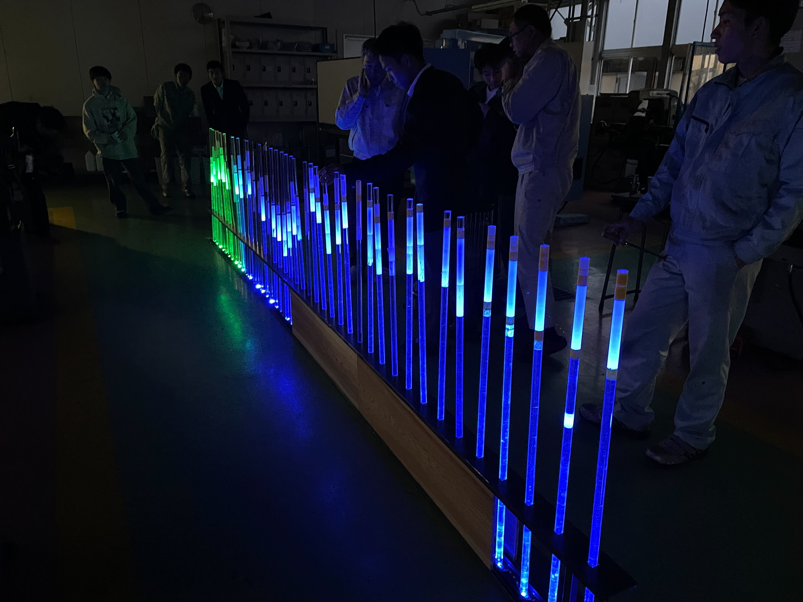
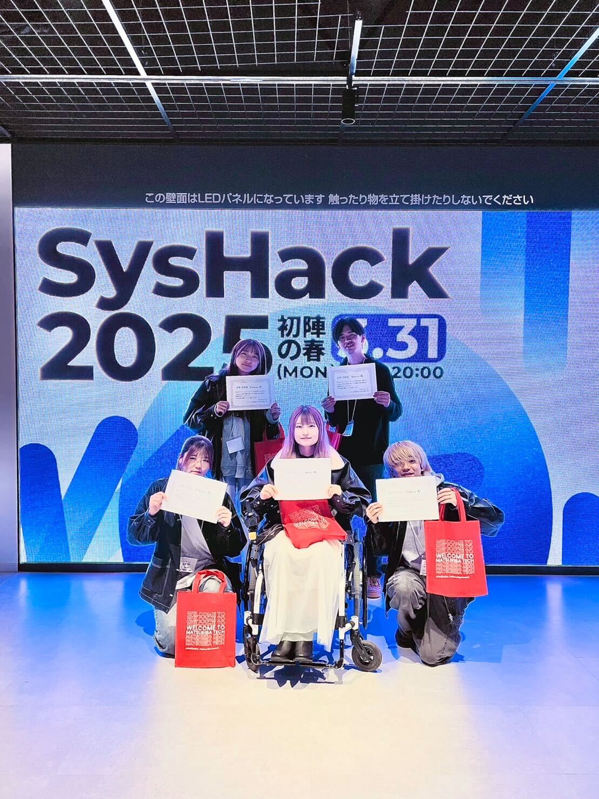
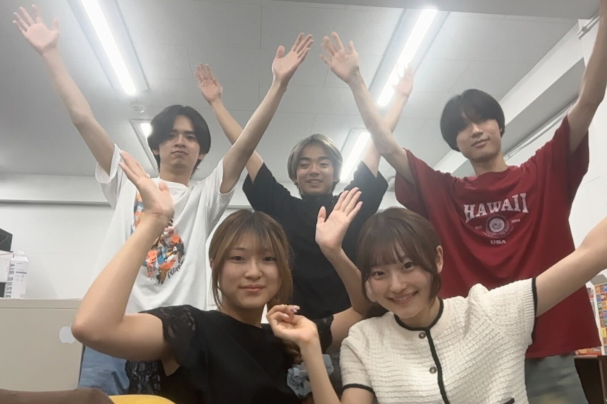
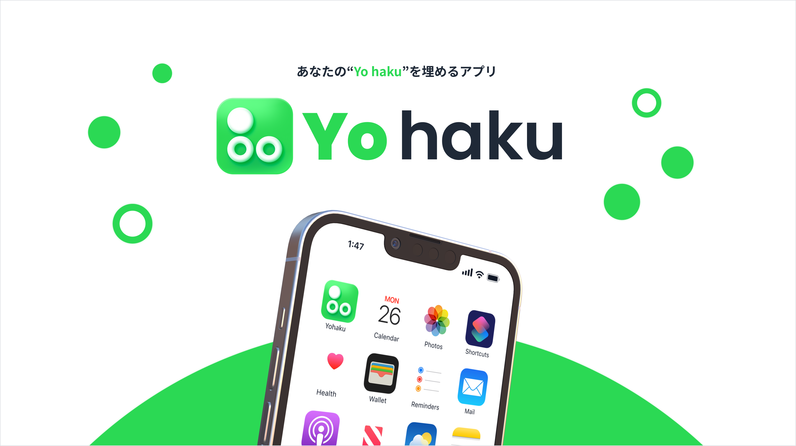

<!-- _class: center -->
# 自己紹介
## 矢部大智

---

# ✋ はじめまして

## 矢部大智

- **年齢**: 20歳
- **所属**: 愛知工業大学
- **サークル**: システム工学研究会
- **出身**: 福井県

---

# 技術スタック
- ### フロントエンド
  - React, Next.js
- ### サーバーサイド
  - Kotlin, Go, AWS
- ### その他
  - C, C++, Arduino

---

# 今までやってきたこと

- **小学時代**
	- 家のパソコンでエクセルにハマる
	- 友達とタイピング対決
	- 職業体験でBASIC言語に触れる
- **中学時代**
	- ゲームが大好き
		-	→ゲーム作りたい！ 
	- 図書館にあった本でC, C++を勉強する
	- 難しすぎて挫折

---

# 今までやってきたこと
- **高校時代**
	- パソコンを買ってもらう
	- C++でAtcoderを始める
	- 課題研究
		- arduinoでイルミネーションを制作

---

---

# 今までやってきたこと

## 大学生
- システム工学研究会に入る
- ハッカソンに参加するため、Web技術を始める
- ハッカソンに複数回出場
- 

---

<!-- _class: center -->
# 📸 活動の様子

  
  

---

# 🎯 今後の目標・展望

- いっぱい**ハッカソンに出る**！
- webを**極める**！
- 大学生を**楽しむ**！！

---

<!-- _class: center -->
# ご清聴ありがとうございました！

## 気軽に話しかけてください！ 🙋‍♂️
