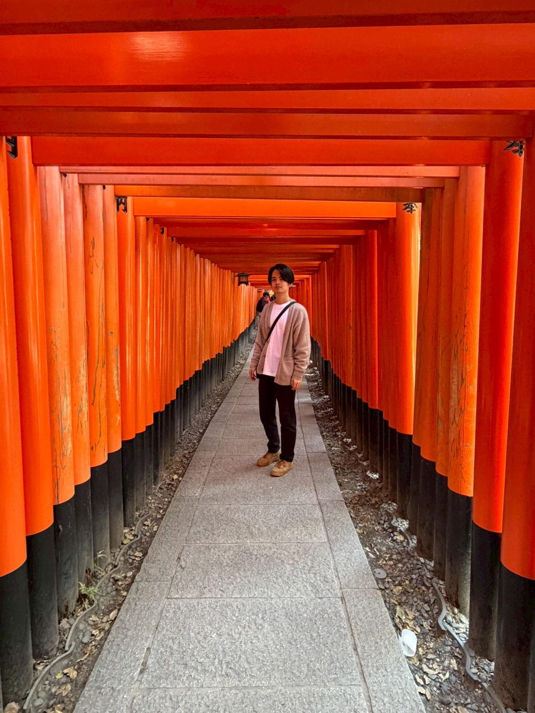
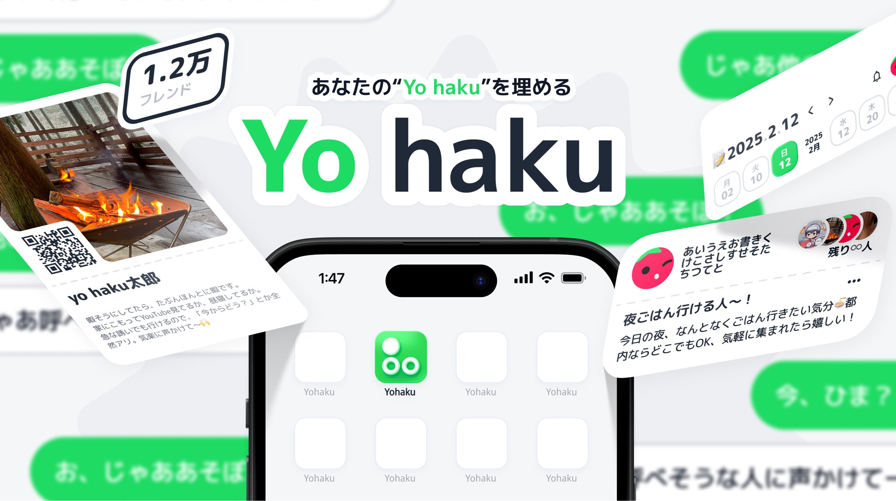
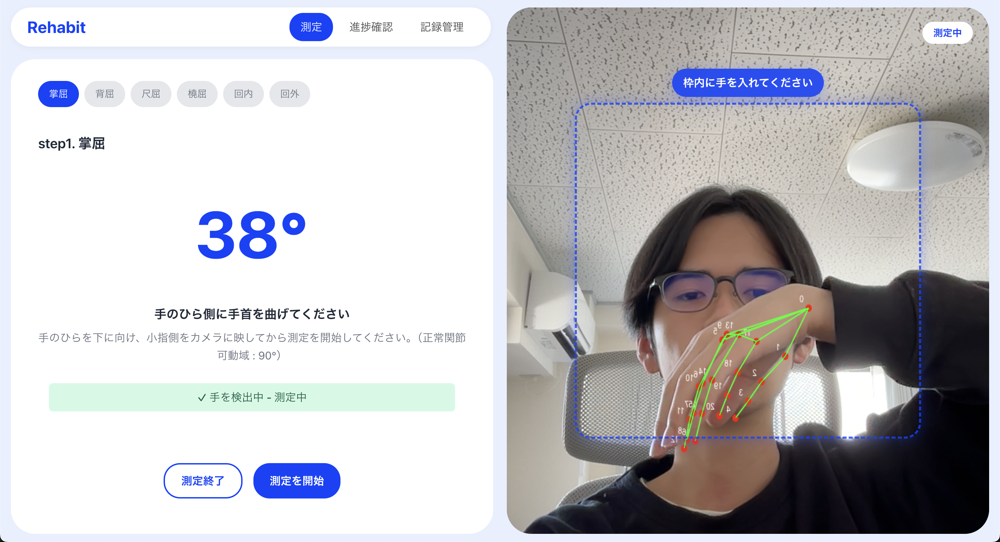

<!-- _class: center -->

# 自己紹介プレゼンテーション

---

# 目次

1. 自己紹介
2. 開発経験
3. 目指すエンジニア像

---

# 自己紹介

---

# 自己紹介

**名前**: 矢部 大智
**年齢**: 20歳（28卒、学部2年）
**出身**: 福井県
**所属**: 愛知工業大学 情報科学部, システム工学研究会, NxTEND
**趣味**: 旅行、絶叫系、スキー・スノボ、食べること

---

# 開発経験

---

# 今までやってきたこと

| 小学生                          | 中学生                                          | 高校生                                           |
| ------------------------------- | ----------------------------------------------- | ------------------------------------------------ |
| 職業体験でBASIC言語に 触れる | ゲームを作りたくなり C / C++を勉強 → 挫折 | AtCoderを始める Arduinoでイルミネーション制作 |

---

# 開発経験

## 大学生

- 1年生
  - システム工学研究会に入会
  - ハッカソンに誘われ、Web技術を始める
  - 初めてのハッカソンに出場
    - ハッカソンにハマる
- 2年生
  - ハッカソンに出場しまくる
  - 長期インターンに参加

---

<!-- _class: center -->

  
  

---

# 株式会社Forgers（長期インターンシップ）

## 検索機能のフロントエンド実装

### 苦労

- UIと検索状態の同期が複雑になり可読性が落ちた

### 解決

- API取得層 / ビジネスロジック / 状態管理 を分離

### 学び

- アーキテクチャの考え方を学んだ

---

# Yo haku（ハッカソン）

## 技術的に挑戦した作品

### 概要

友達をご飯や遊びに気軽に誘えるアプリ

### 技術

- React
  - インターンで学んだアーキテクチャを実践
- Go
  - SwaggerやER図などで設計してから実装
- AWS
  - 初めてのインフラ

---

# Rehabit（ハッカソン）

## プロダクトとして満足している作品

### 課題

リハビリは効果を実感しづらくサボってしまう

### プロダクト

モチベーション維持のためのリハビリ記録アプリ

### 工夫

- UXを重視した設計
  - 自分でも使いたいと思えるように
- AIを活用して短期間で作成（2日ほど）

---

---

# 技術スタック

## ⭐️⭐️⭐️ 自信あり

## ⭐️⭐️ ある程度できる

## ⭐️ 触ったことがある

---

# 目指すエンジニア像

#### 技術を使って顧客の課題を適切に解決するプロダクトを作ることができる エンジニアになりたい

## そのために今後何をするか

- チーム開発の経験をさらに増やす
- 与えられた要件の意図を汲み取り、適切に実装する能力を身につける
- 課題に合った技術選定を適切に行うため、幅広く知識をつける

---

<!-- _class: center -->

# ありがとうございました

<!-- キャリア
インターン
自己PR -->
