<!-- _class: center -->

# 自己紹介プレゼンテーション

---

# 目次

1. 自己紹介
2. 開発経験
3. 目指すエンジニア像

---

# 自己紹介

---

# 自己紹介

**名前**: 矢部 大智
**年齢**: 20歳（28卒、学部2年）
**出身**: 福井県
**所属**: 愛知工業大学 情報科学部, システム工学研究会, NxTEND
**趣味**: 旅行、絶叫系、スキー・スノボ、食べること

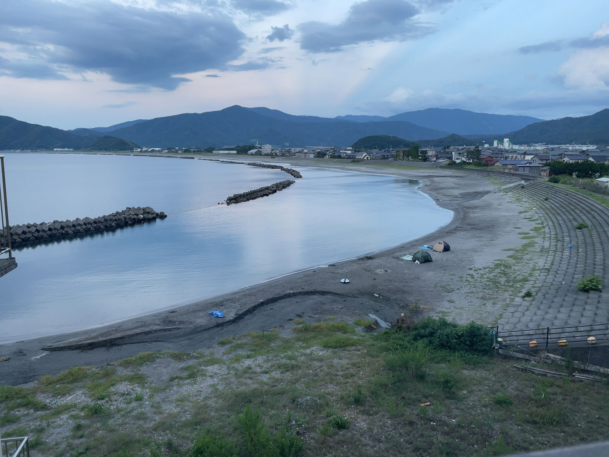

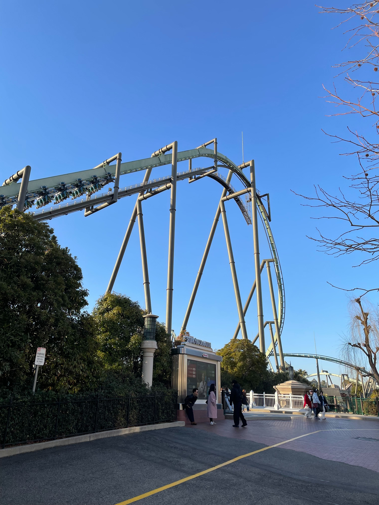
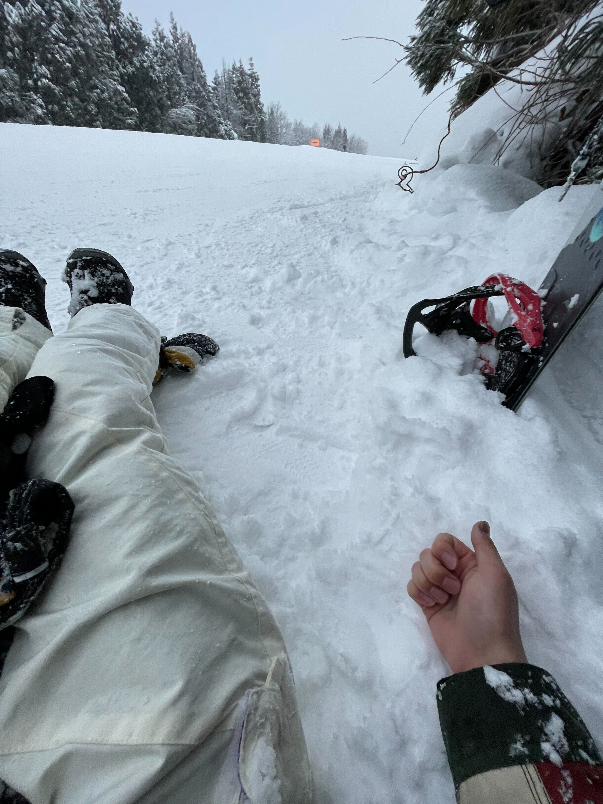

---

# 開発経験

---

# 今までやってきたこと

| 小学生                          | 中学生                                          | 高校生                                       |
| ------------------------------- | ----------------------------------------------- | -------------------------------------------- |
| 職業体験でBASIC言語に 触れる | ゲームを作りたくなり C / C++を勉強 → 挫折 | AtCoderを始める Arduinoでイルミネーション制作 |

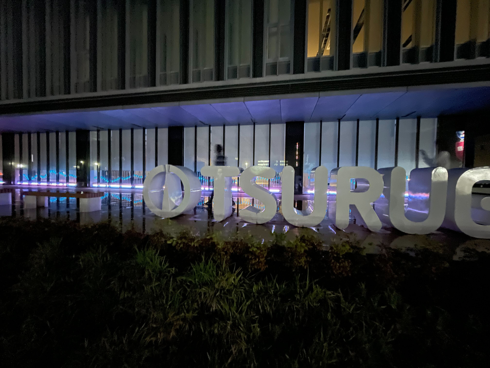

---

# 開発経験

## 大学生

- 1年生
  - システム工学研究会に入会
  - ハッカソンに誘われ、Web技術を始める
  - 初めてのハッカソンに出場
    - ハッカソンにハマる
- 2年生
  - 長期インターンに参加
  - ハッカソンに出場しまくる

---

<!-- _class: center -->

  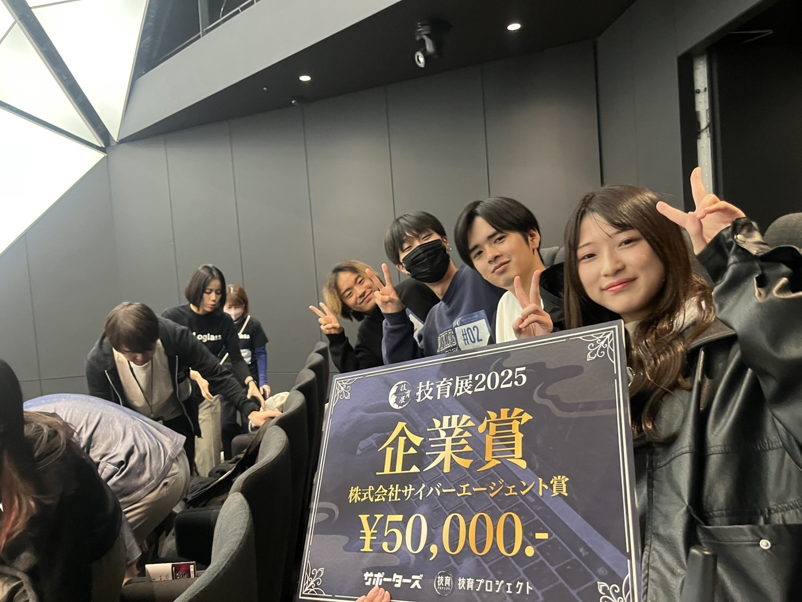
  

---
# 開発経験
## ハッカソン
---
# 開発経験
## インターン
---

# 技術スタック

## ⭐️⭐️⭐️ よく使う

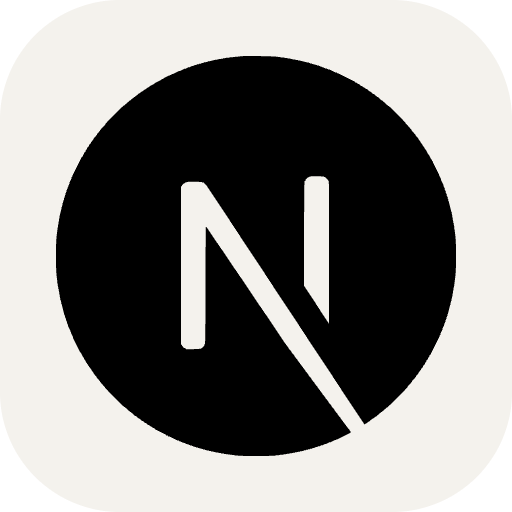
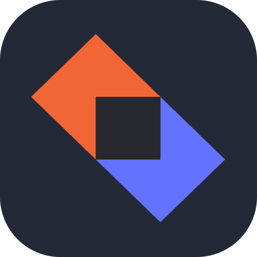
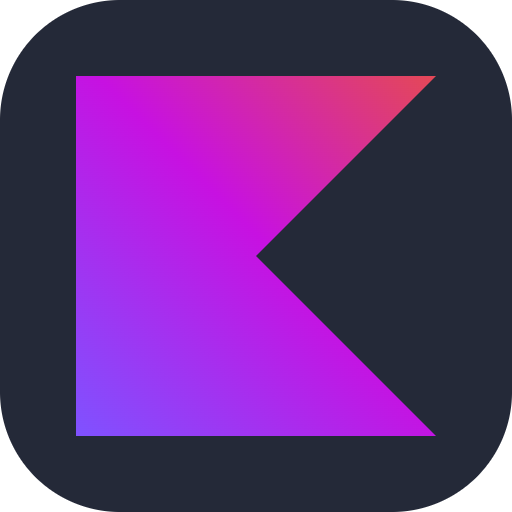

## ⭐️⭐️ 少しできる

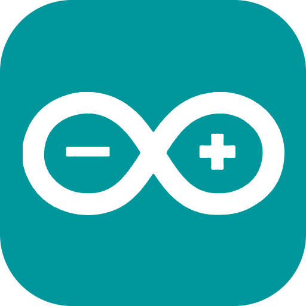

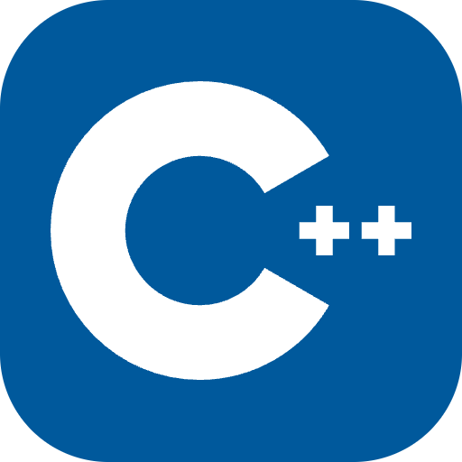

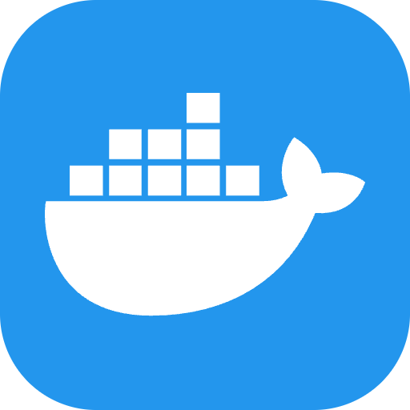
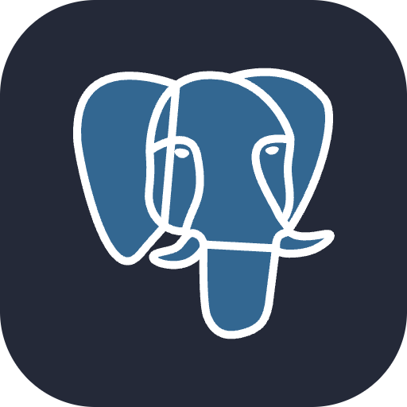

## ⭐️ 触ったことがある

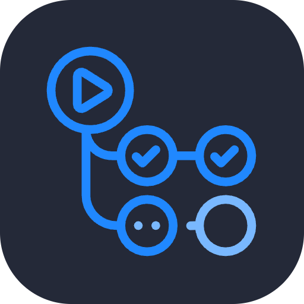
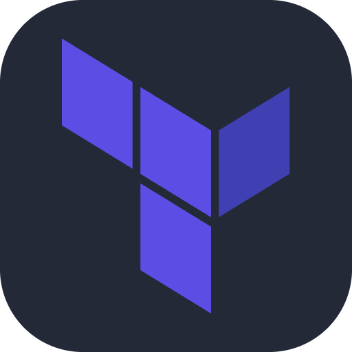
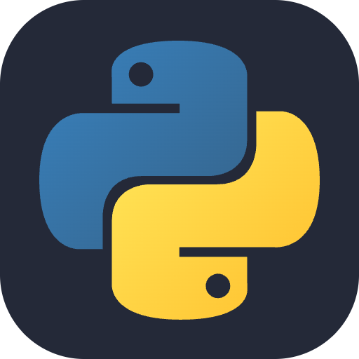
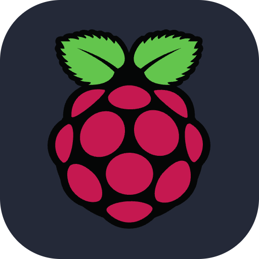
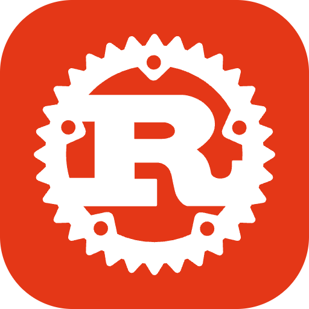

---
# 目指すエンジニア像
---

## 技術を使って顧客の課題を適切に解決するプロダクトを作れる エンジニアになりたい

---

# そのためには
- 現状
  - 特定の技術だけでなく、様々な技術に触れるようにしている
- 今後
  - さらにチーム開発などの経験を増やす
  - 与えられた要件の意図を汲み取り、適切に実装できる

---

<!-- _class: center -->

# ありがとうございました

<!-- キャリア
インターン
自己PR -->
