<!-- _class: center -->

# 自己紹介プレゼンテーション

---

# 目次

1. 自己紹介
2. 開発経験
3. 目指すエンジニア像

---

# 自己紹介

---

# 自己紹介

**名前**: 矢部 大智
**年齢**: 20歳（28卒、学部2年）
**出身**: 福井県
**所属**: 愛知工業大学 情報科学部, システム工学研究会, NxTEND
**趣味**: 打楽器、旅行、絶叫系、スキー・スノボ、美味しいものを食べること

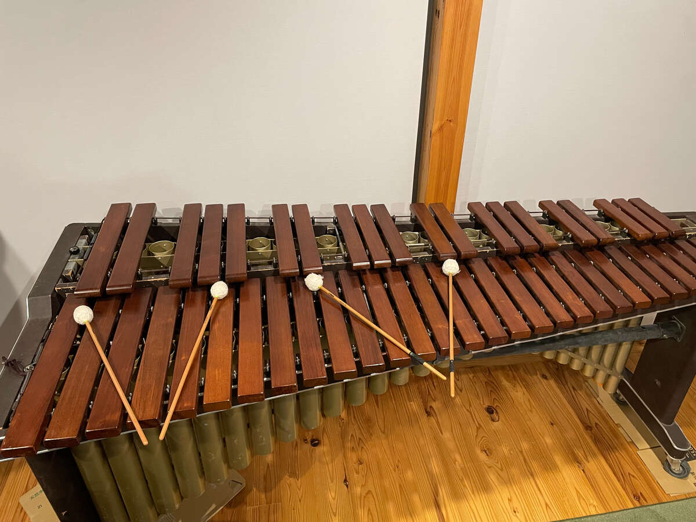
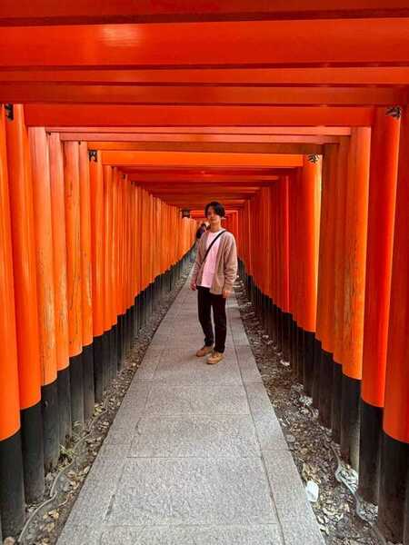
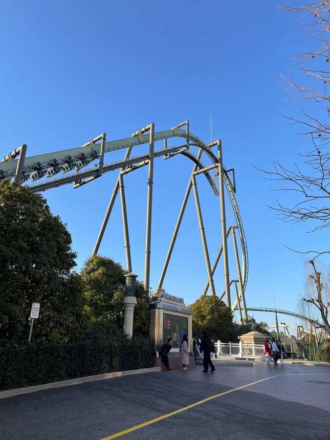
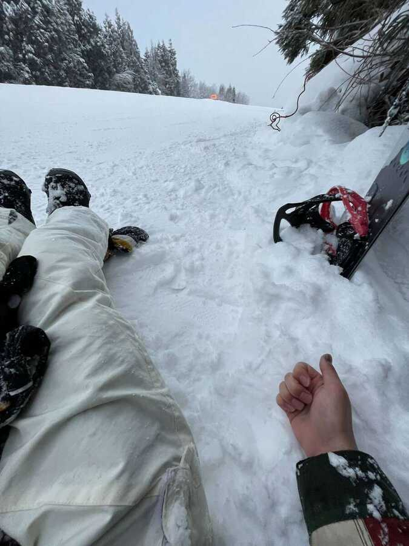

---

# 開発経験

---

# 今までやってきたこと

| 小学生                          | 中学生                                             | 高校生                                           |
| ------------------------------- | -------------------------------------------------- | ------------------------------------------------ |
| 職業体験でBASIC言語に 触れる | ゲームが好きだった ので C / C++を勉強 → 挫折 | AtCoderを始める Arduinoでイルミネーション制作 |

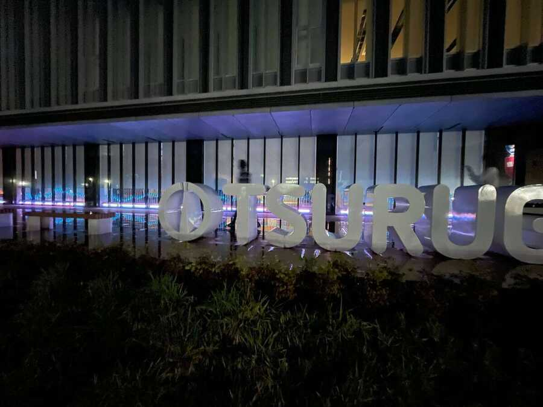

---

# 開発経験

## 大学生

- 1年生
  - システム工学研究会に入会
  - ハッカソンに誘われ、Web技術を始める
  - 初めてのハッカソンに出場
    - ハッカソンにハマる
- 2年生
  - ハッカソンに出場しまくる
  - 長期インターンに参加

---

<!-- _class: center -->

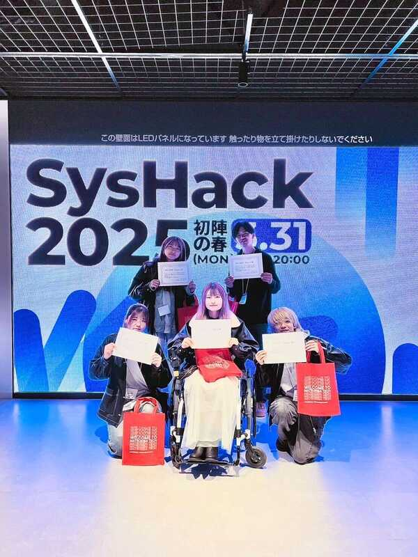

  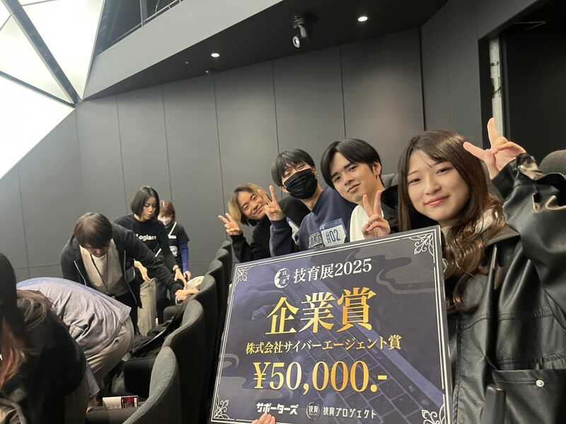
  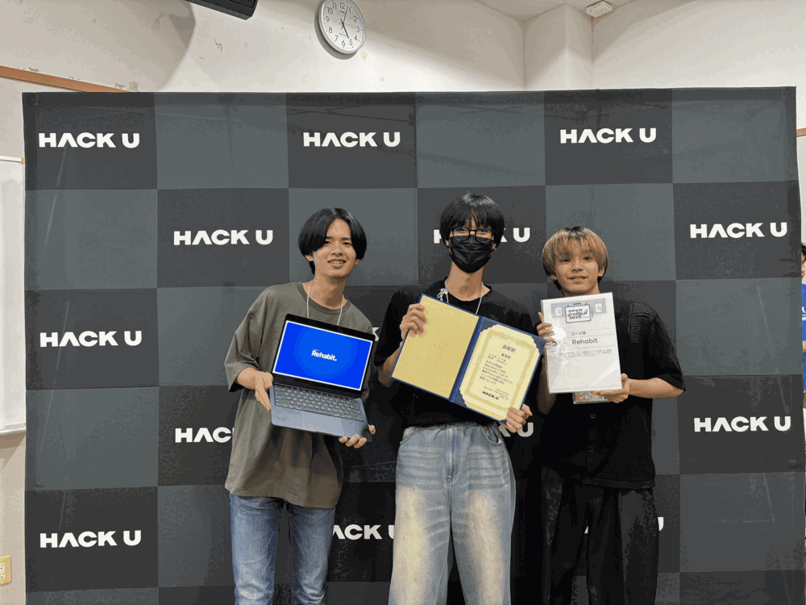

---

# 株式会社Forgers（長期インターンシップ）

## 新規機能開発

新規機能の開発を設計から実装までたんとうした。

### 苦労したこと

- どのようなUIがユーザは使いやすく感じるのか

### 工夫したこと

- 既存サービスを参考
- メンターに何度も見てもらう

ユーザに使ってもらうUIについてしっかり考える機会になった。

---

# Yo haku（ハッカソン）

### 概要

友達をご飯や遊びに気軽に誘えるアプリ

### 課題

普段の友達や、地元の疎遠になった友達をもっと気軽に誘いたい！

### 技術

- React: インターンで学んだアーキテクチャを実践
- Go: 初めてのバックエンド、設計を試行錯誤しながら実装。
- AWS: 初めてのインフラ。フロント/バックエンドのCICDを実装。

---

# Rehabit（ハッカソン）

### プロダクト

リバビリ箇所の可動域を計測して効果を可視化するアプリ

### 課題

リハビリは効果を実感しづらく、継続のモチベーションが下がりやすい。

### 工夫

- UXを重視した設計
  - 「自分でも毎日使いたいと思えるか」を意識
  - 継続しやすい体験を重視

---

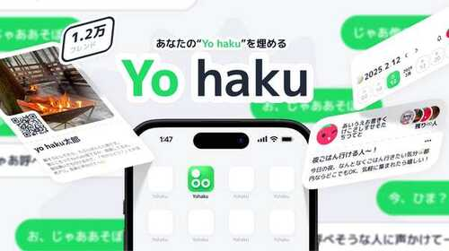
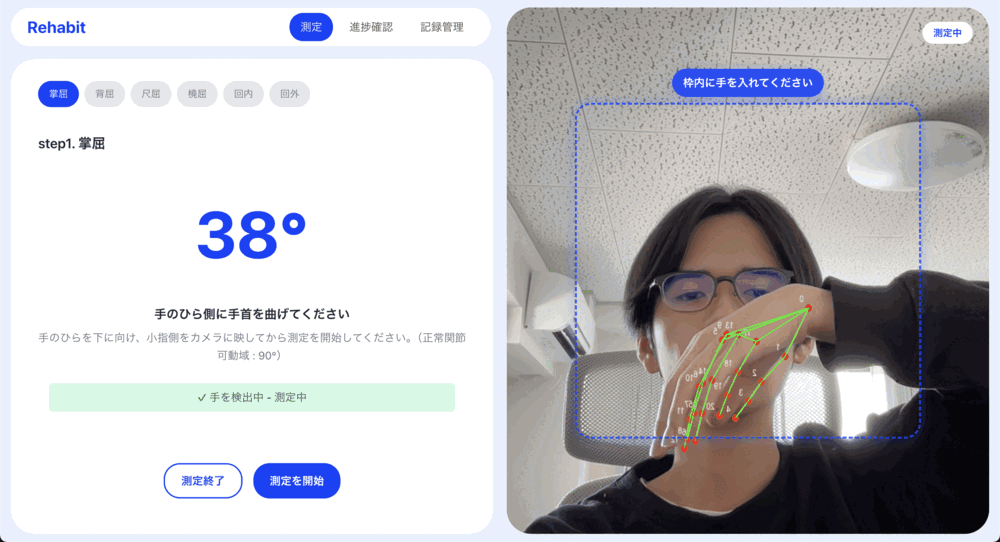

---

# 技術スタック

## ⭐️⭐️⭐️ 自信あり

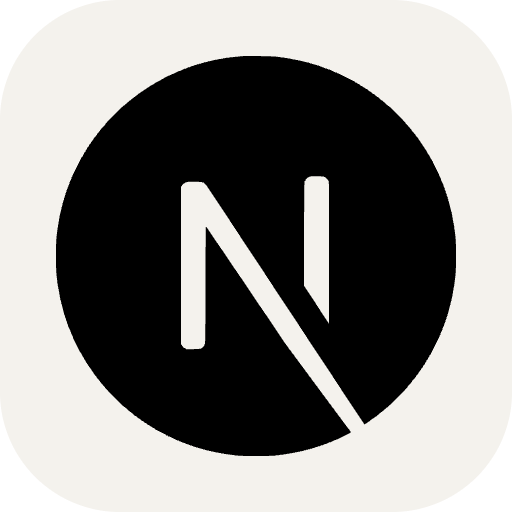

## ⭐️⭐️ すこしできる

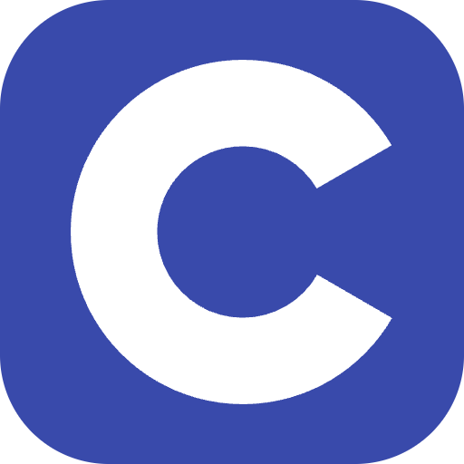
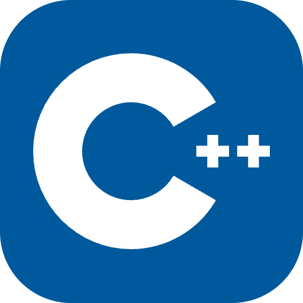
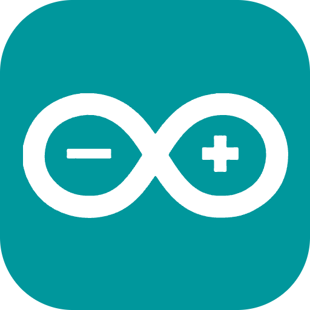
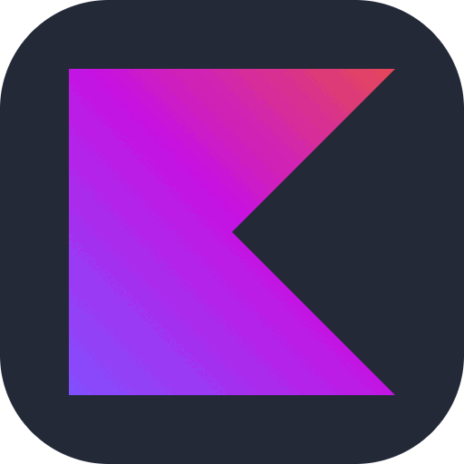
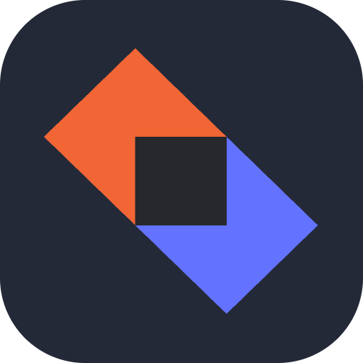

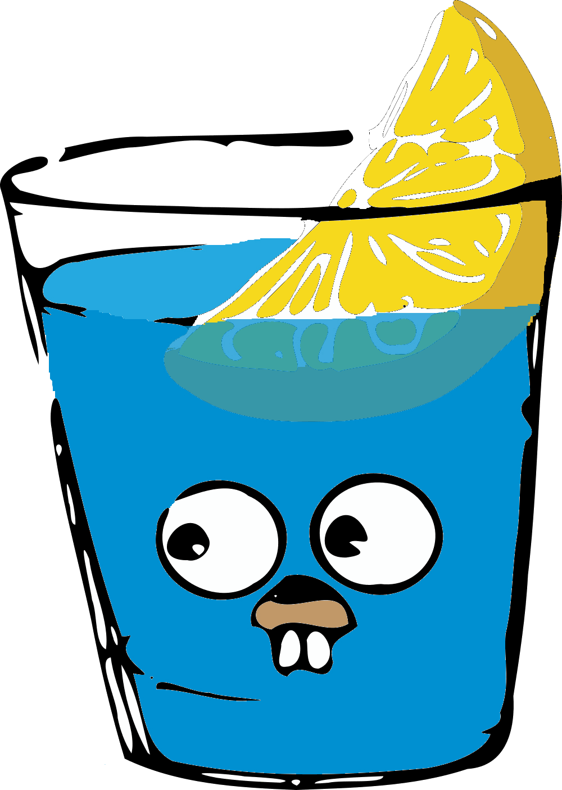
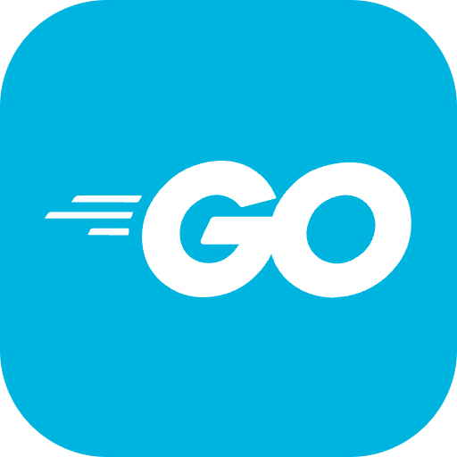

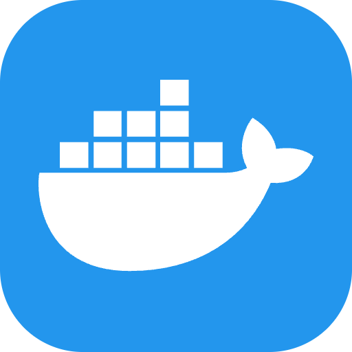
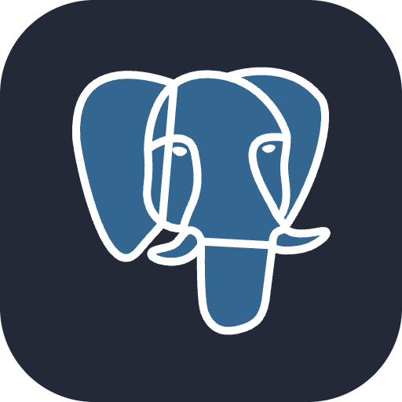

## ⭐️ 触ったことがある

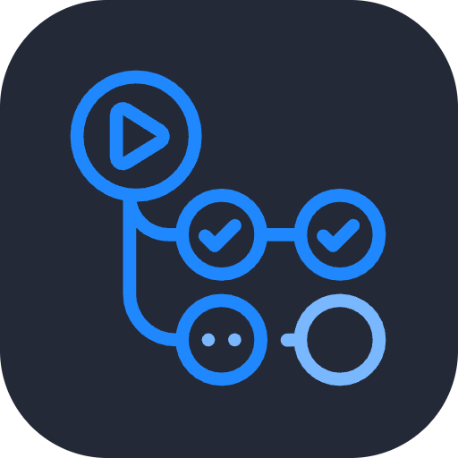
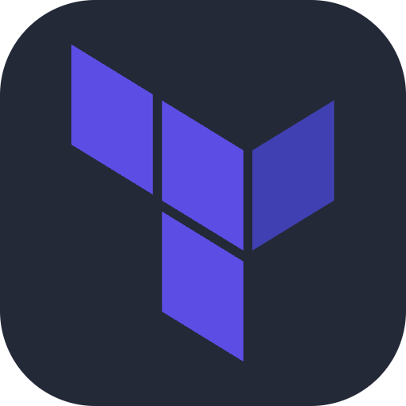
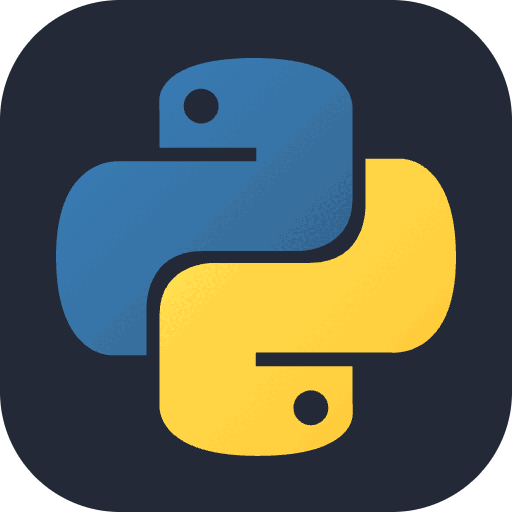
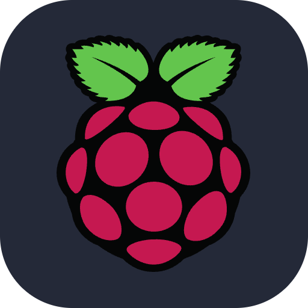
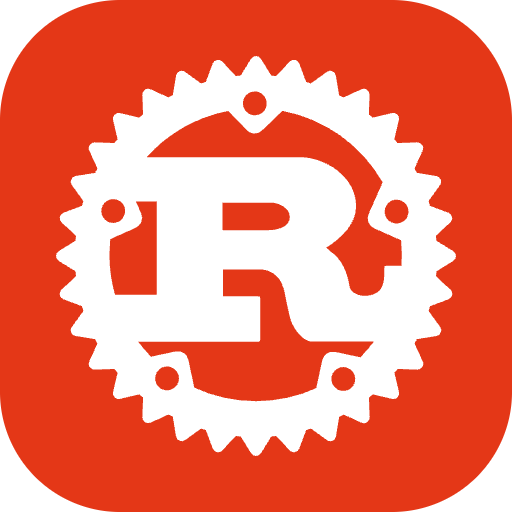

---

# 目指すエンジニア像

#### 人に元気を与えるプロダクトを作りたい

## そのために今後何をするか

- フロントエンド・バックエンド両方の技術力を高める
- UI/UXについて学び、使いやすさや楽しさを意識した設計を行う
- インターンやチーム開発で実践経験を積む

---

<!-- _class: center -->

# ありがとうございました

<!-- キャリア
インターン
自己PR -->
